# portfolio
My recent and past works.

## websites

   
  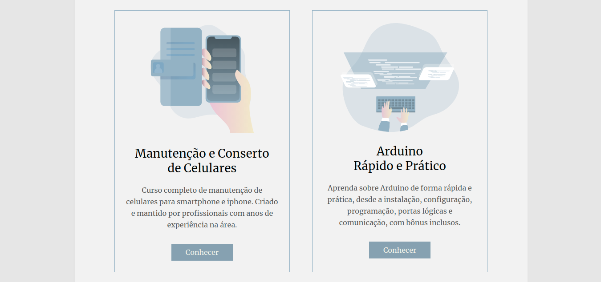  
  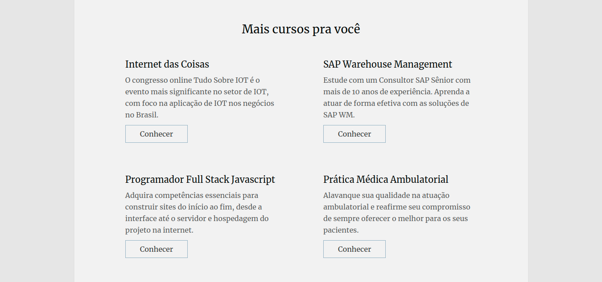  
    
  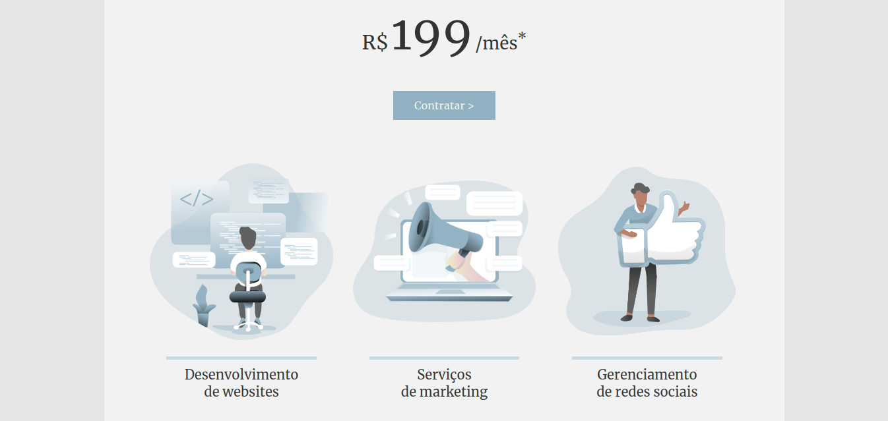  
  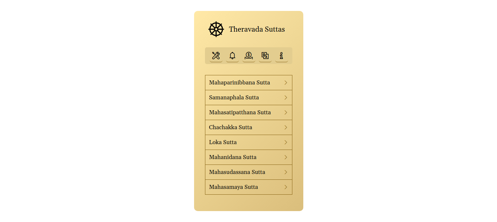  
  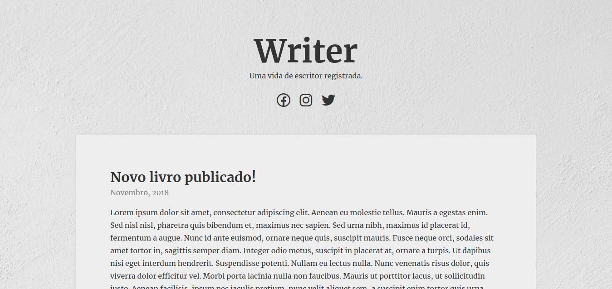  
  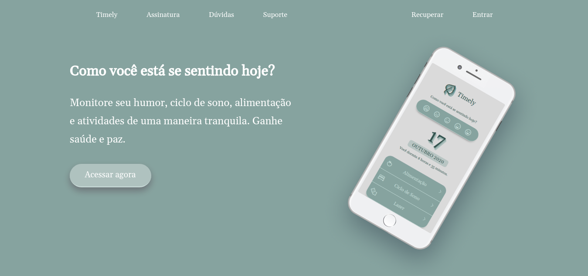  
  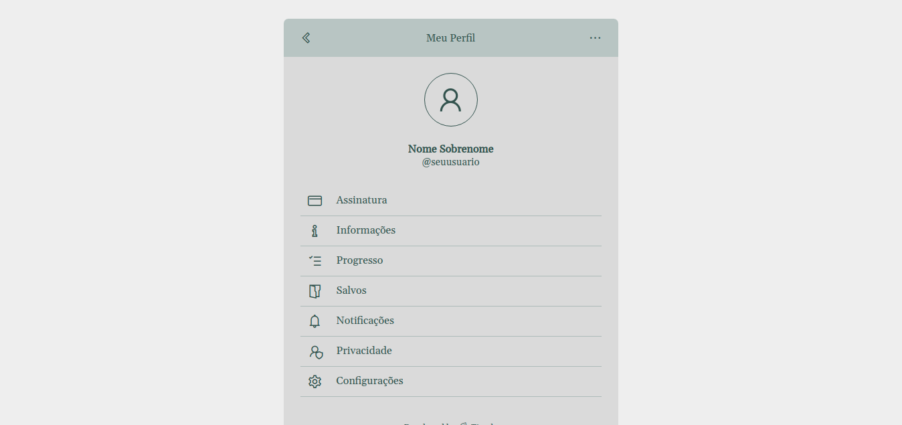  
  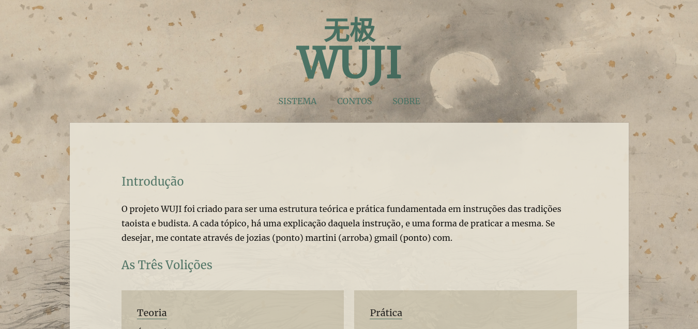  
    
  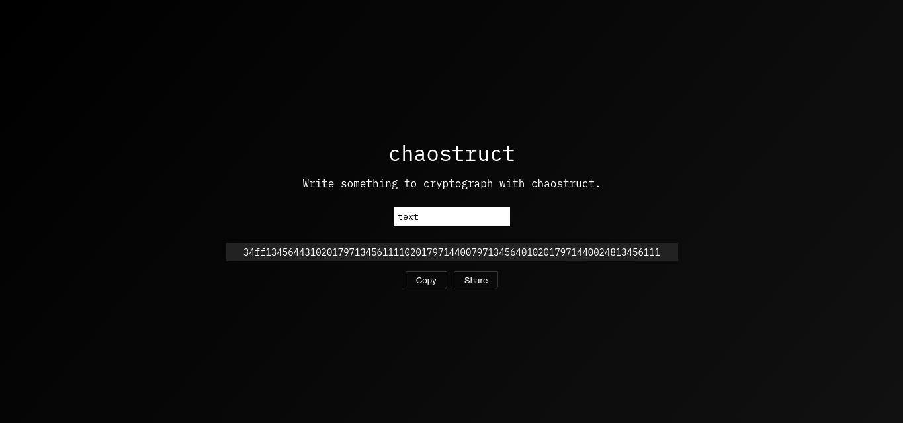  
  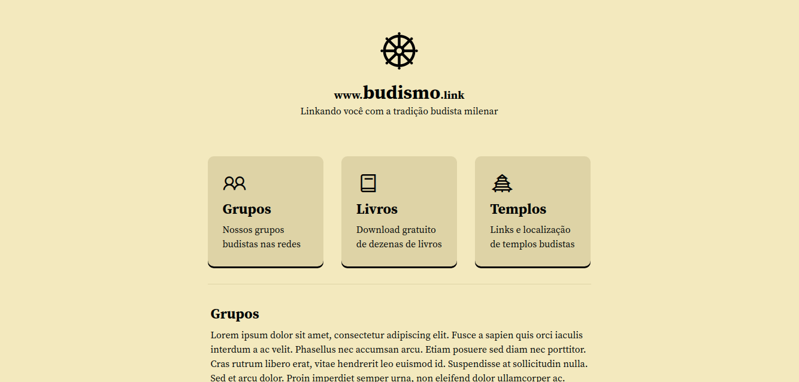  
  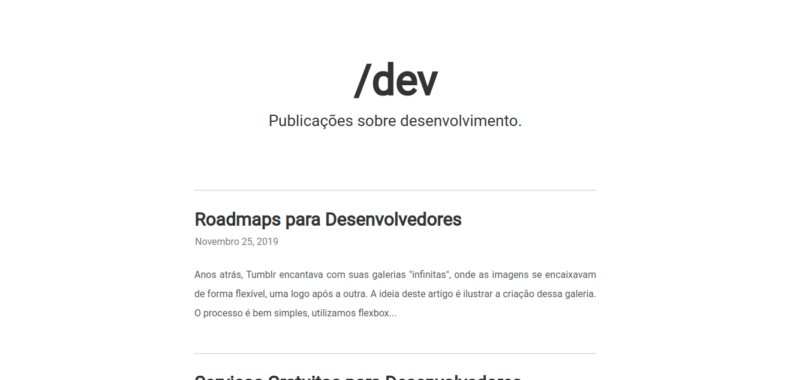  
  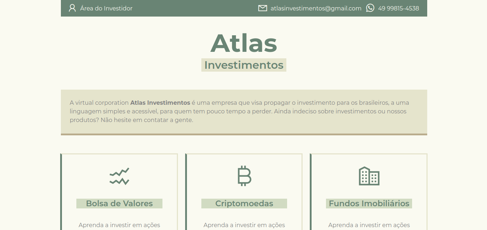  
  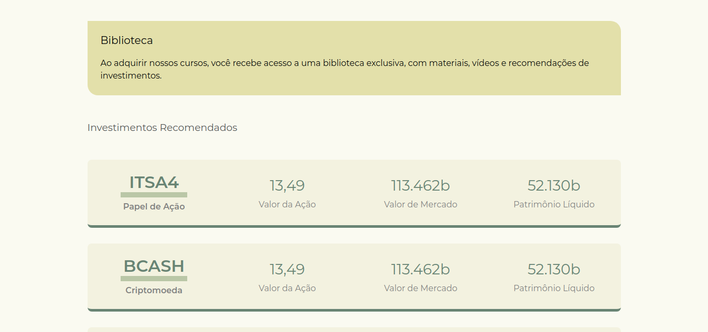  
  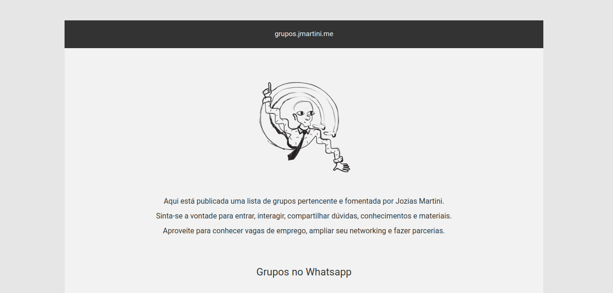  
  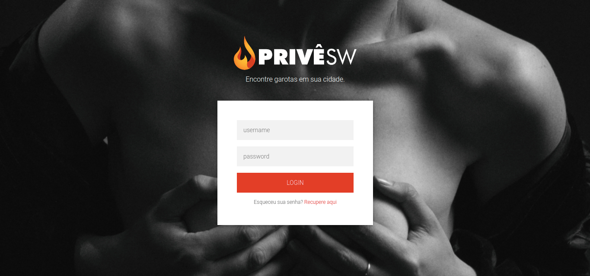  
  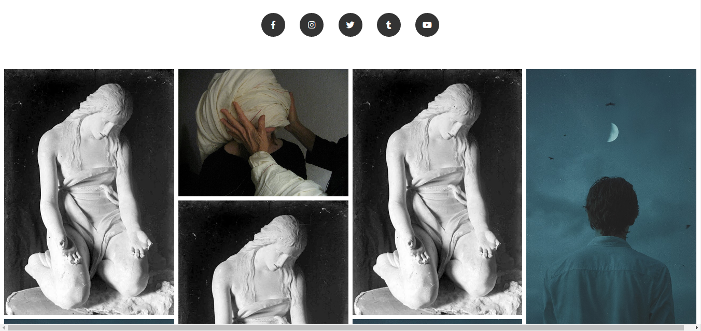  
  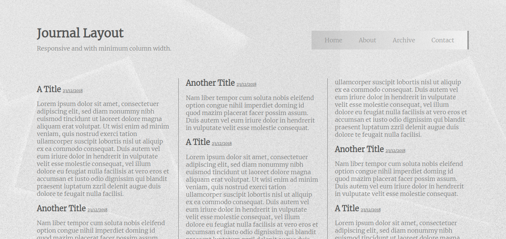  
   

## designs

   
    
    
    
    
    
    
    
    
    
    
    
   

